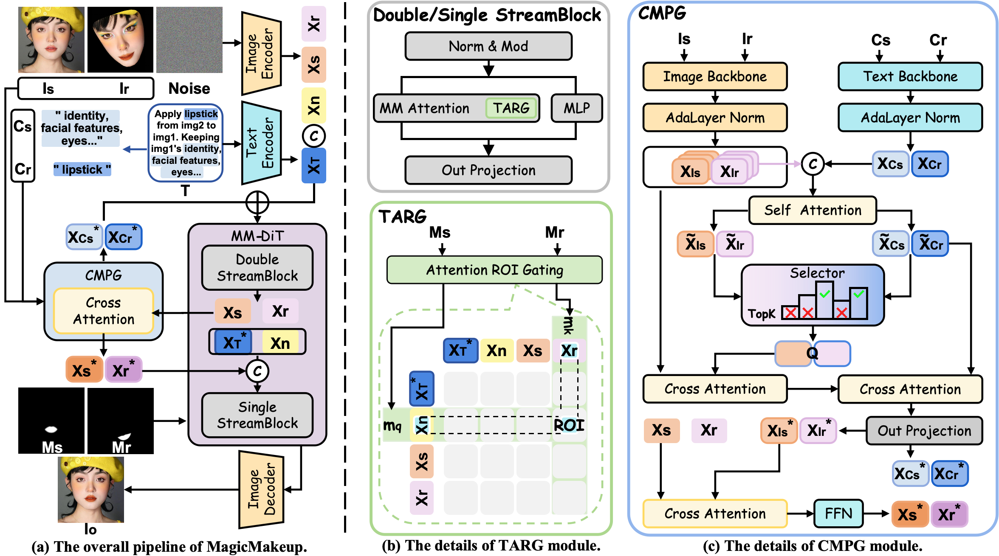

<div align=center>

</div>

<h1 align="center">[ECCV 2026] MagicMakeup: A Region-Controllable Diffusion Transformer for High-Fidelity Makeup Transfer</h1>
<div align="center">

<h4>

📄 Paper: Coming Soon &nbsp;
<a href="[https://github.com/vivoCameraResearch/magicmakeup](https://vivocamera.github.io/MagicMakeup)">🌐 Project Page</a> &nbsp;
<a href="https://huggingface.co/Anyou/MagicMakeup">🤗 Hugging Face Models</a>
</h4>

</div>

<div align="center">

</div>

<div align="center">
<strong><i>MagicMakeup</i>: a diffusion transformer for high-fidelity, region-controllable makeup transfer.</strong>
</div>

## 📖 Overview

### Abstract

Makeup transfer applies the reference makeup to the source face while preserving the source identity. Despite advances in full-face editing by diffusion-based methods, strong regional controllability, makeup fidelity, and identity preservation remain challenging. The reasons are (i) pixel-to-attention misalignment that causes spillover into non-target areas and weakens regional control; (ii) unclear transfer/preservation concept separation under two-image conditioning, leading to coupling between makeup attributes and identity; and (iii) the lack of a high-resolution dataset that is identity-consistent and region-labeled for fine-grained supervision. In this paper, we propose MagicMakeup, a diffusion transformer-based framework for region-controllable and high-fidelity makeup transfer, built on spatial constraints and concept disentanglement. To enable precise region-specific editing while preserving identity, we propose Token-Aligned Region Gating, which aligns pixel masks with attention and applies region-specific logit gating. To clarify the concepts of transfer and preservation, we further introduce Cross-Modal Perception Guidance, which aligns text and image features to enhance cross-modal concept perception. We also design a pipeline for the generation of $1024 \times 1024$ data pairs through region-specific makeup removal and establish a unified benchmark in synthetic and real settings. Extensive quantitative and qualitative experiments show that MagicMakeup improves regional controllability, makeup fidelity, and identity preservation, with strong robustness across styles, races, and poses.

### Architecture

<div align="center">

</div>

## 🛠️ Environment Setup

Run all commands below from the repository root:

```bash
git clone https://github.com/vivoCameraResearch/Magic-Makeup.git
cd Magic-Makeup
```

Create the environment and install the main dependencies:

```bash
conda create -n magicmakeup python=3.10 pip -y
conda activate magicmakeup

pip install torch==2.6.0 torchvision==0.21.0 torchaudio==2.6.0 \
  --index-url https://download.pytorch.org/whl/cu124

pip install -r requirements.txt
```

Install the optional evaluation dependencies:

```bash
pip install lpips torch-fidelity
pip uninstall -y clip
pip install -e evaluate/CLIP-main
```

The first face-parsing and DINO evaluation runs may download their public
pretrained weights.

## 📦 Model Preparation

MagicMakeup uses
[FLUX.1-Kontext-dev](https://huggingface.co/black-forest-labs/FLUX.1-Kontext-dev)
as its base model. Accept the model license and download the Diffusers-format
repository:

```bash
huggingface-cli login
huggingface-cli download black-forest-labs/FLUX.1-Kontext-dev \
  --local-dir /path/to/FLUX.1-Kontext-dev
```

Download the [MagicMakeup](https://huggingface.co/Anyou/MagicMakeup) checkpoint:

```bash
huggingface-cli download Anyou/MagicMakeup \
  --local-dir /path/to/MagicMakeup-checkpoint
```

MagicMakeup also uses
[SigLIP So400m/14](https://huggingface.co/google/siglip-so400m-patch14-384).
It is downloaded automatically on the first run. For offline use, download it
in advance and set its local path:

```bash
huggingface-cli download google/siglip-so400m-patch14-384 \
  --local-dir /path/to/siglip-so400m-patch14-384

export SIGLIP_MODEL_PATH=/path/to/siglip-so400m-patch14-384
```

## 🚀 Test

### 1. Prepare the Data

The recommended directory layout is:

```text
data/
|-- source/
|   |-- raw/
|   |-- image/
|   `-- mask/
|       |-- face/
|       |-- eyes/
|       `-- lip/
`-- makeup/
    |-- raw/
    |-- image/
    `-- mask/
        |-- face/
        |-- eyes/
        `-- lip/
```

Image and mask IDs must match. Both mask naming styles are supported:

```text
image/0001.jpg
mask/0001.png
mask/0001_mask.png
```

### 2. Crop Face Images

`prepocess/crop.py` detects the main face, filters invalid samples, produces
a centered `1024 x 1024` crop, and writes `log.tsv`.

Crop source images:

```bash
python prepocess/crop.py \
  --input_dir data/source/raw \
  --out_dir data/source/image \
  --det_model mediapipe/blaze_face_short_range.tflite \
  --lmk_model mediapipe/face_landmarker.task \
  --expand 0.8 \
  --min_face_ratio 0.1
```

Crop reference images:

```bash
python prepocess/crop.py \
  --input_dir data/makeup/raw \
  --out_dir data/makeup/image \
  --det_model mediapipe/blaze_face_short_range.tflite \
  --lmk_model mediapipe/face_landmarker.task \
  --expand 0.8 \
  --min_face_ratio 0.1
```

Add `--keep_subdirs` when the input directory hierarchy should be retained.

### 3. Generate Masks

#### Face masks

`faceparsing.py` uses `jonathandinu/face-parsing` to create binary face masks.

```bash
python prepocess/faceparsing.py \
  --img_path data/source/image \
  --save_path data/source/mask/face \
  --recursive

python prepocess/faceparsing.py \
  --img_path data/makeup/image \
  --save_path data/makeup/mask/face \
  --recursive
```

#### Eyes or lip masks

`regionmask.py` uses MediaPipe landmarks to generate regional masks.

```bash
# Eyes masks
python prepocess/regionmask.py \
  --input_dir data/source/image \
  --output_dir data/source/mask/eyes \
  --regions eyes

python prepocess/regionmask.py \
  --input_dir data/makeup/image \
  --output_dir data/makeup/mask/eyes \
  --regions eyes

# Lip masks
python prepocess/regionmask.py \
  --input_dir data/source/image \
  --output_dir data/source/mask/lip \
  --regions lip

python prepocess/regionmask.py \
  --input_dir data/makeup/image \
  --output_dir data/makeup/mask/lip \
  --regions lip
```

### 4. Single-Pair Inference

```bash
python test_single.py \
  --model_path /path/to/FLUX.1-Kontext-dev \
  --lora_path /path/to/MagicMakeup-checkpoint \
  --source_image data/source/image/0001.png \
  --source_mask data/source/mask/face/0001.png \
  --reference_image data/makeup/image/0001.png \
  --reference_mask data/makeup/mask/face/0001.png \
  --label eyes,lip,face \
  --output_path outputs/0001_0001.jpg \
  --panel_path outputs/0001_0001_panel.jpg
```

`--label` accepts `eyes`, `lip`, or `eyes,lip,face`. The default `model_offload` mode reduces VRAM use; add
`--memory_mode sequential_offload` only when more memory saving is required.

### 5. Batch Inference

`test_dir.py` matches images and masks by filename stem: every source is paired with every makeup reference.
Images without matching masks are reported and skipped.

```bash
python test_dir.py \
  --model_path /path/to/FLUX.1-Kontext-dev \
  --lora_path /path/to/MagicMakeup-checkpoint \
  --source_images data/source/image \
  --source_masks data/source/mask/face \
  --reference_images data/makeup/image \
  --reference_masks data/makeup/mask/face \
  --output_dir outputs/face \
  --panel_output_dir outputs/face_panel \
  --label eyes,lip,face
```

## 📊 Evaluation

The evaluation pipeline has three stages.

### 1. Generate the source-reference CSV

This creates the `src,ref` Cartesian product expected by `prevalu.py`:

```bash
python evaluate/generate_pairs_csv.py \
  --src_dir data/source/image \
  --ref_dir data/makeup/image \
  --output_csv metrics/pairs.csv
```

### 2. Detect landmarks and build the evaluation CSV

Generated images must use the `{source_stem}_{reference_stem}.jpg` naming
convention produced by `test_dir.py`.

```bash
python evaluate/prevalu.py \
  --model mediapipe/face_landmarker.task \
  --input_csv metrics/pairs.csv \
  --gen_dir outputs/face \
  --out_root metrics/run1 \
  --model_name MagicMakeup \
  --target_width 1024 \
  --target_height 1024
```

This writes:

```text
metrics/run1/
|-- MagicMakeup.csv
|-- src/
`-- gen/MagicMakeup/
```

### 3. Compute metrics

The following command computes Self-Sim, DINO-I, CLIP-I, BG-MSE, FID, and KID:

```bash
python evaluate/evalu.py \
  --pairs_csv metrics/run1/MagicMakeup.csv \
  --out_csv metrics/run1/results.csv \
  --target_size 1024 1024 \
  --batch_size 16 \
  --skip_face_id
```

Face-ID is optional and requires two pretrained
[CVLFace](https://github.com/mk-minchul/CVLface) models. Download both the
[AdaFace recognition model](https://huggingface.co/minchul/cvlface_adaface_vit_base_kprpe_webface12m)
and the
[DFA alignment model](https://huggingface.co/minchul/cvlface_DFA_mobilenet):

```bash
huggingface-cli download \
  minchul/cvlface_adaface_vit_base_kprpe_webface12m \
  --local-dir evaluate/cvlface/adaface_vit_base_kprpe_webface12m

huggingface-cli download \
  minchul/cvlface_DFA_mobilenet \
  --local-dir evaluate/cvlface/DFA_mobilenet
```

Then run the evaluation without `--skip_face_id`:

```bash
python evaluate/evalu.py \
  --pairs_csv metrics/run1/MagicMakeup.csv \
  --out_csv metrics/run1/results.csv \
  --target_size 1024 1024 \
  --batch_size 16 \
  --recognition_model_id evaluate/cvlface/adaface_vit_base_kprpe_webface12m \
  --aligner_id evaluate/cvlface/DFA_mobilenet
```

FID and KID require `torch-fidelity` and enough samples for meaningful
distribution statistics. Evaluation weights may be downloaded on the first
run. The DINO ViT-B/8 checkpoint is downloaded automatically by `torch.hub`
and cached in the PyTorch checkpoints directory.

## 🙏 Acknowledgements

This project builds on the following open-source projects:

- [FLUX.1-Kontext-dev](https://huggingface.co/black-forest-labs/FLUX.1-Kontext-dev)
- [Diffusers](https://github.com/huggingface/diffusers)
- [MediaPipe](https://github.com/google-ai-edge/mediapipe)
- [DINO](https://github.com/facebookresearch/dino)
- [CLIP](https://github.com/openai/CLIP)
- [CVLFace](https://github.com/mk-minchul/CVLface)

We thank the authors and maintainers for making their work available.

## Ethical Considerations

MagicMakeup and its benchmark are intended only for non-commercial academic research on cosmetic makeup transfer and must not be used for identity recognition, face swapping, impersonation, or deceptive manipulation. Any real-face benchmark release will be de-identified and provided through gated access under a Data Usage Agreement that prohibits redistribution and identity-related misuse, with bias disclosure and an opt-out/removal mechanism for individuals and rights holders.

## 📜 Citation

If you find MagicMakeup useful for your research, please cite:

```bibtex
@inproceedings{magicmakeup2026,
  title     = {MagicMakeup},
  author    = {Ziyi Wang, Siming Zheng, Yang Yang, Shusong Xu, Hao Zhang, Bo Li, Changqing Zou, Peng-Tao Jiang},
  booktitle = {European Conference on Computer Vision (ECCV)},
  year      = {2026}
}
```
